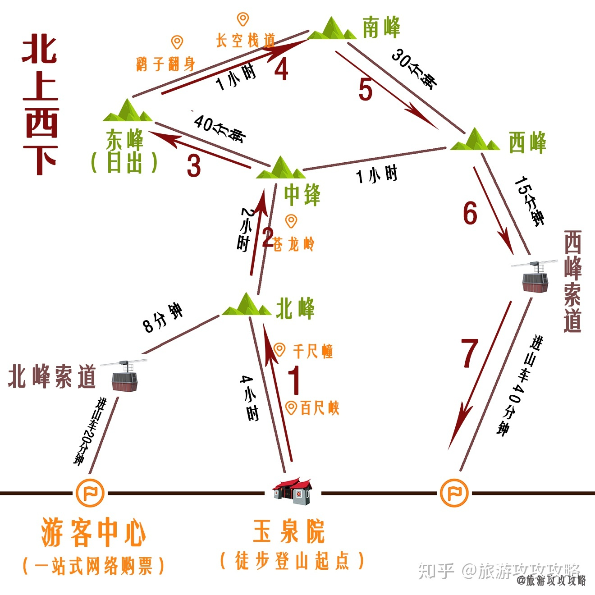

`2021年清明节，我们准备西安旅游，这是旅行之前做的一个简单的规划。希望我们能收获一趟完美的旅行`

# Checklist

- [x] 交通预订
- [x] 住宿安排
- [ ] 景点规划

# 交通

来回乘坐高铁，单程3~4个小时。

| 时间                     | 班次  | 站点                |
| ------------------------ | ----- | ------------------- |
| 2020-04-02 19:03 ~ 22:46 | D1952 | 成都东站 - 西安北站 |
| 2020-04-05 18:05 ~ 21:41 | D1947 | 西安北站 - 成都东站 |

# 住宿

4月2号~4月4号入住[西安中心戴斯酒店](https://hotels.corporatetravel.ctrip.com/hotels/436507.html)，该酒店离钟楼、鼓楼、回民街以及西安城墙都比较近。到西安北站也大概30分钟的车程。比较方便。

~~4月4号酒店暂时没有预订。如果入住体验一般或者准备4月4号准备去华山一趟，再订一个比较近的酒店。~~

4月4号去华山玩一天，没有换酒店，这样登山的时候可以不用带行李。

# 第一天计划

# 第二天计划

从西安到华山北站来回高铁。

| 时间                     | 班次  | 站点                |
| ------------------------ | ----- | ------------------- |
| 2020-04-04 07:22 ~ 07:58 | G3198 | 西安北站 - 华山北站 |
| 2020-04-04 18:59~ 19:27  | G3293 | 华山北站 - 西安北站 |

从华山北站到游客中心来回可以打车。

游览华山有多条路线，这里选择**北上西下**：

* 由于游览时间只有一天，所以不能选择太长的路线。
* 要看日出的话，得凌晨徒步登山，提前一天晚上入住华山脚下。这个行程安排不过来（本次旅游的主体还是西安）。
* 西上北下比较轻松，北上西下可以挑战比较险峻的苍龙岭。徒步登山时间大概是5~6小时，还是有一定考验的。
* 早上高铁出发时间07:22，6点左右就得起床。3号晚上一定要休息好。