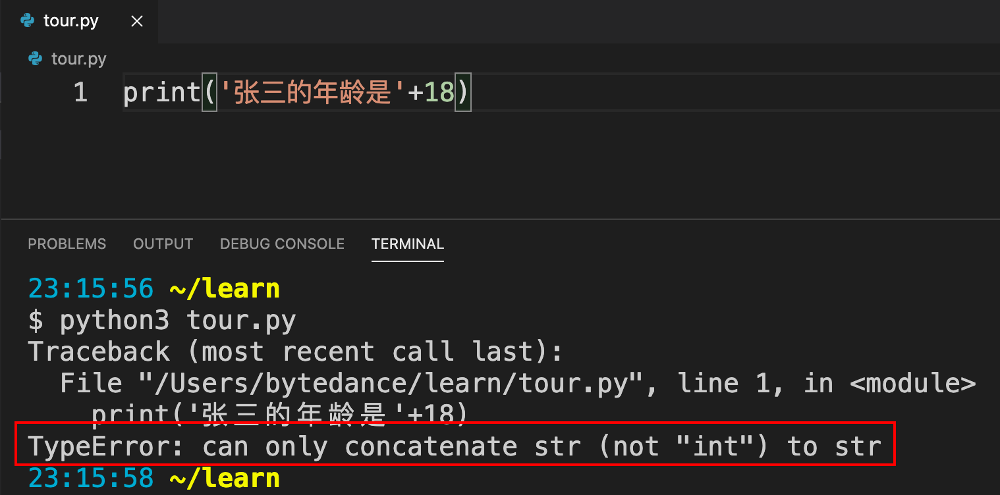

# 数据类型

讲清楚变量之前，我们得先讲清楚什么是数据类型，以及我们为什么需要数据类型。

数据类型是编程语言提供的对于现实中各个事物的类型的抽象，从某种意义上说，编程语言提供的数据类型越丰富，表达能力越强。比如说我们用`'张三'`来表示一个人的名字，用`18`来表示他的年龄，那么我们能够对这些数据进行什么操作呢？以下这个程序的执行结果是什么呢？

```python
print('张三的年龄是'+18)
```

如果你执行这个程序，会发现并没有输出预料中的**张三的年龄是18**，而是报错了



python的解释器告诉我们发生了类型错误，只有字符串(str)能够拼接到字符串，整数（int）不行。所以我们用数据类型来区分不同的数据，确定这些数据上能够进行的操作（即运算符）。

`+`对于不同的数据类型有不同的含义，对于字符串来说是拼接

```python
print('张三的年龄是' + '18')
```

对于整形来说是求和

```python
print(100 + 100)
```

那么python提供了哪些数据类型呢?

## 1. 基本数据类型

### 1.1 字符串（str）

`'abc'`，`'张三'`，`"18岁"`这样的数据都是字符串，即用单引号或者双引号括起来的任意数量的字符。

### 1.2 整形（int）

`0`，`1`，`-1000`这样的数据是整形，与数学中整数的概念相同。

### 1.3 浮点型（float）

`1.0`，`-2.`，`3.3`， `1e6`这样的数据是浮点型，相当于数学中的小数。注意计算机中的浮点数是不精确的。运行以下程序试一下：

```python
print(0.1+0.2)
print(0.1+0.1+0.1-0.3)
```

为什么计算机处理这种简单的计算会有问题呢？我们知道，所有的数据在计算机内部都是二进制表示的。所以计算之前，计算机会把所有的十进制数转换成二进制，而计算完成后，会将二进制的结果转换回来。

0.1<sub>(10)</sub> = 0.00011001100110011...<sub>(2)</sub>

可以看到，0.1是一个无限循环的二进制小数，而浮点数使用的存储是有限的，所以在转换过程损失了精度。在python中（以及其他遵循浮点数标准的语言），浮点数的数值范围为`1e-308~1e+308`，有效数字的位数为17位。这个精度对于一般的应用来说已经完全足够了。

### 1.4 布尔类型（bool）

布尔类型只有两个值`True`，`False`。它的概念和数学中布尔代数的中布尔值的含义是一致的。

## 1.5 复数（complex）

`1+2j`，`3.0j`

## 2. 组合数据类型

以上4个类型是基本所有的编程语言会提供的。python提供了以下组合类型，极大地提高了表达能力。

### 2.1 元组（tuple）

形如`(x,y,...)`的数据拥有tuple类型。我们可以用`(1, 2)`表示平面直角坐标系中的一个点，用`(1,2,3)`表示空间直角坐标系的一个点。`(x,y,...)`中的x和y可以是任意类型，也不必要相同。`((1,2),(3,4))`可以用来表示一条线段，`('张三',18,175.0)`可以用来表示一个人的信息。

### 2.2 列表（list）

形如`[x,y,...]`的数据拥有list类型。看起来list和tuple表达的东西是一样的。但是有一个根本的区别，list是可变的，tuple是不可变的。这个区别使得我们使用两种类型的场景截然不同。以后用到的时候再细讲。

### 2.3 集合（set）

形如`{x,y,...}`的数据拥有set类型。集合和数学中的集合概念一致：不重复的一组数据。比如一家公司员工年龄的集合。

运行以下程序，看是否和你预期的输出一致。

```python
print({1,1,2,2})
print({1,1,2,'2'})
```

## 2.4 词典 （dict）

词典是键值对（key-value-pair）的集合，提供了高效的通过键查找值的能力。在有的语言会把这种类型叫做map，从数学的角度来讲，词典的本质是映射。这是一个很有用的数据类型。具体的使用到用到的时候再讲。形式如`{1:20，2:40}`

